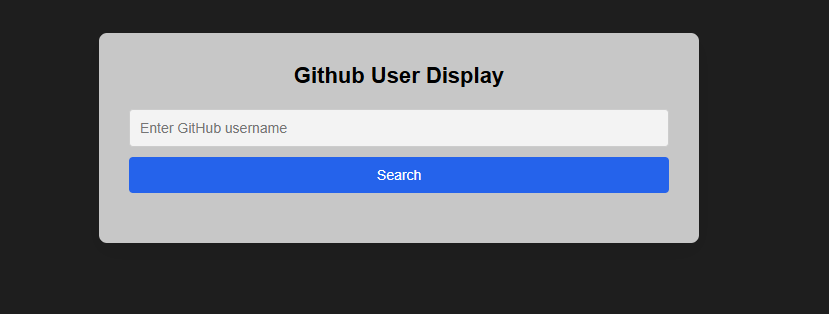
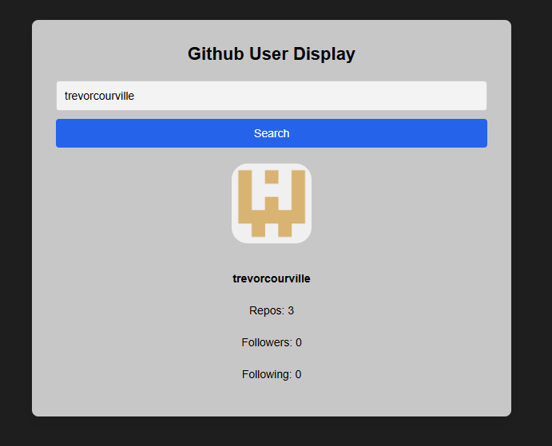

# GitHub User API Dashboard

A lightweight frontend TypeScript/Vite application that allows users to search for GitHub profiles and view account information using the GitHub REST API.

## Features

- Search for any public GitHub username
- Displays profile image and key stats
- Loading state during API requests
- Minimal, responsive UI

## Running

```bash
git clone https://github.com/trevorcourville/GitHub-User-API-Dashboard.git
cd ts-api-dashboard
npm install
npm run dev
```

- Open http://localhost:5173/ in browser

## Screenshots


